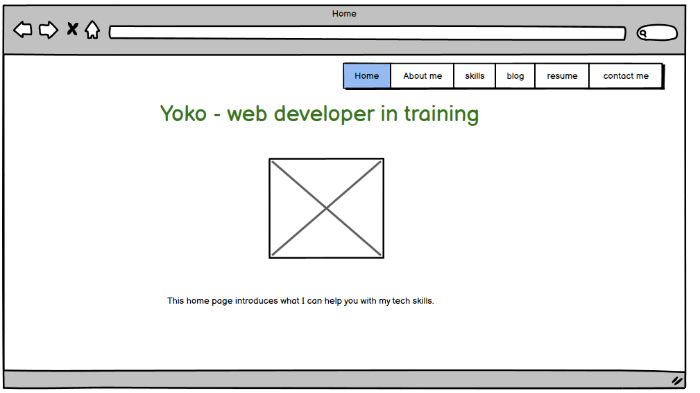
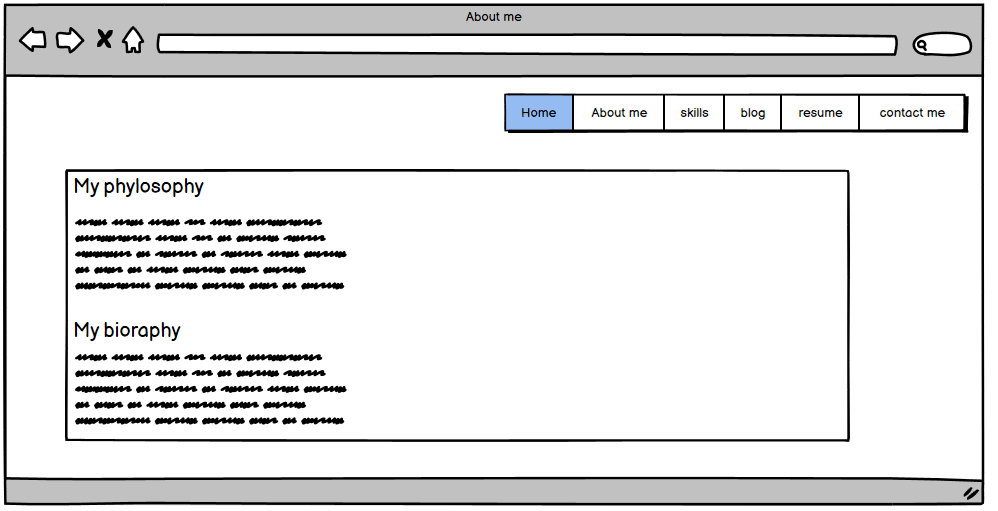
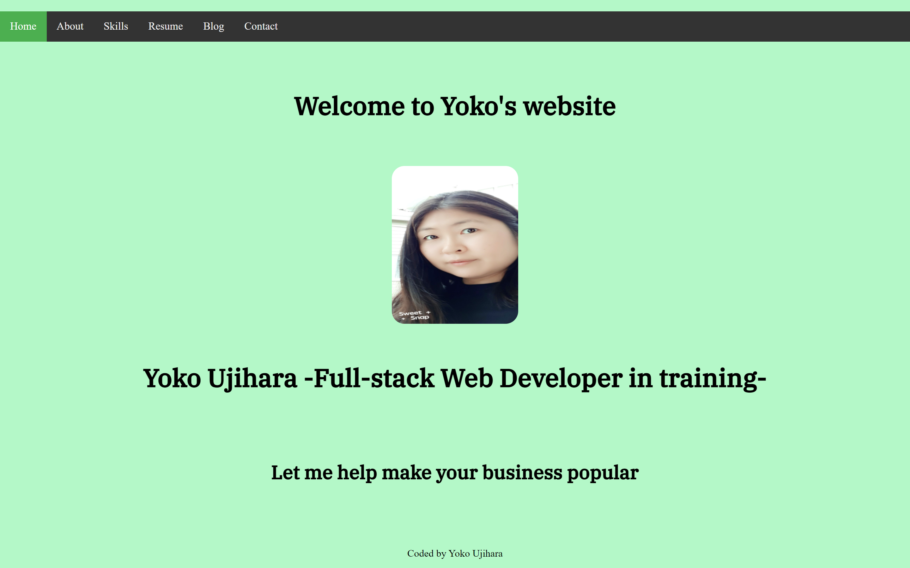

# README documet for Yoko's website #

## A link (URL) to my published portfolio website ##

[Yoko's website]https://yoko-portfolio.netlify.app/

## A link to my GitHub repo ##
[Yoko's GitHub repo]https://github.com/Yoko-cyer/Portfolio_CA

---

# Description of my portfolio website #
## Purpose ##

1. It is part of the assignments of Coder Academy requirements 
2. To showcase my projects to my future clients and employers
3. To communicate with my potential clients

## Target audience ##

1. Teachers and students in Coder Academy
2. My future clients and employer especially in hospitality industry

## Tech stack (e.g. html, css, deployment platform, etc) ##

- HTML
- CSS
- Javascript --- for hambarger menu
- Google font 
- Favicon gnerator --- To create favicon
- Balsamic --- Wirefarame
- Trello --- Project management tool
- Git/Github
- Netlify --- To host
- Responsive, Flexbox

## Functionality / features ##

- Habergar menu for easy transfer to other pages
- Used green background color to attrac future clients in hospitality
- Made enough spacing for easy reading
- Contact form for communication

# Screenshots #

## Sitemap ##

## Wireframe ##

### Home ###

### About ###

### Skills ###

### Resume ###

### Blog ###

### Contact ###

## Actual website image ##

### Home ### 

### About ### 

### Skills ### 

### Resume ### 

### Blog ### 

### Contact ### 

